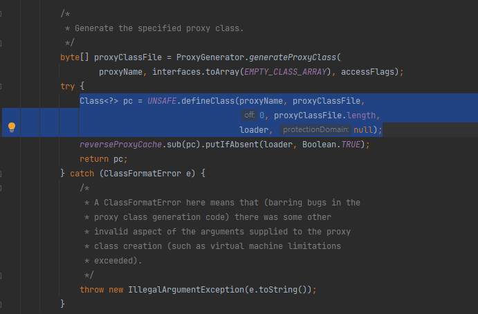
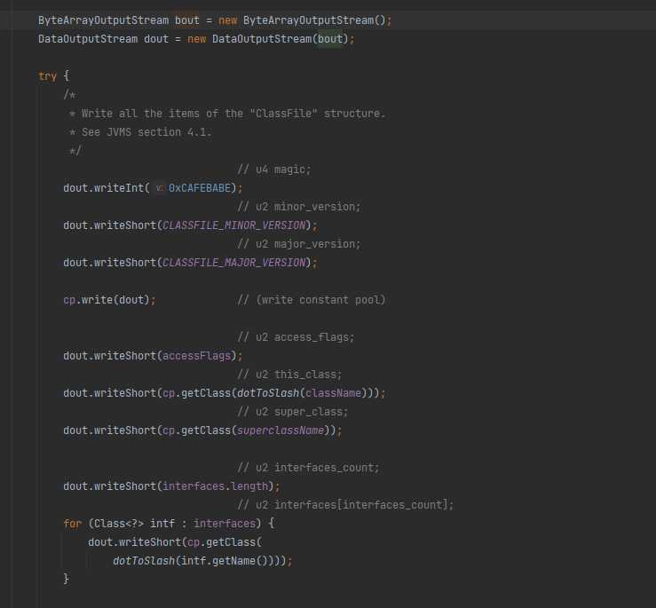

# dynamic proxy deep dive

- AOP의 근본 중 하나인 Dynamic Proxy에 대해 deep dive한다.
- dynamic proxy의 핵심은 Proxy 객체로 원 객체를 감싸는 것이다.

## scratch code example
- dynamic proxy가 사용하는 내부 동작에 대한 예시 코드를 가져왔다.

```java
public interface Animal {
    String crawl();
}


public class Tiger implements Animal {
    @Override
    public String crawl() {
        return "어흥";
    }
}

@Slf4j
public class AnimalInvocationHandler implements InvocationHandler {
    Object target;

    public AnimalInvocationHandler(Object target) {
        this.target = target;
    }

    @Override
    public Object invoke(Object proxy, Method method, Object[] args) throws Throwable {
        log.info("animal invocation handler!");

        if (method.getName().equals("crawl")) {
            return method.invoke(target, args);
        }

        return null;
    }
}

```

```java
//in main method
Animal a = (Animal) Proxy.newProxyInstance(Animal.class.getClassLoader(), new Class[]{Animal.class}, new AnimalInvocationHandler(new Tiger()));

log.info(a.crawl());
```
- Animal이라는 객체의 crawl 메서드를 호출하면, AnimalInvocationHandler의 invoke가 호출된다.
- invoke의 method는 원 객체의 crawl 메서드이다.


## 내부 동작

newProxyInstance 내부에서는 아래 과정이 진행된다.

1. Proxy 클래스를 생성한다.
2. Proxy 클래스를 reflection으로 instance로 만들어 리턴한다.


Proxy 클래스를 생성한다는 뜻은 .class 파일의 내용을 만들어서 classLoader에 등록한다는 뜻이다.



```generateProxyClass```를 통해 얻은 class를 ```defineClass```로 classLoader에 등록한다. (아마 initialization까지 진행될 것 같다.)


```generateProxyClass```는 .class 파일에 들어가는 내용들을 byte[] 형태로 한 땀 한 땀 작성한다. 내부적으로 ```ProxyGenerator```가 reflection api를 활용하여 class 파일을 만드는 데 필요한 class name, method, return type, parameter 등등을 byte array 형태로 write하는 것이다.




```generateProxyClass```가 Proxy 클래스를 생성할 때는 아래의 특징을 갖도록 만든다.

1. Proxy 클래스는 interface의 모든 non-static method를 오버라이딩한다.
2. Proxy 클래스는 InvocationHandler를 파라미터로 받는 생성자를 유일하게 가진다.

그러니 Proxy 클래스는 대략 이런 모습이다.
```java

public class Proxy64 implements Animal {
    InvocationHandler h;


    public Proxy64(InvocationHandler h) {
        this.h = h;
    }

    public String m0() {
        return (String) h.invoke(...);
    }
}
```

결국 a.crawl() -> proxy64.m0() -> AnimalInvocationHandler.invoke() -> tiger.crawl() 순으로 호출된다.